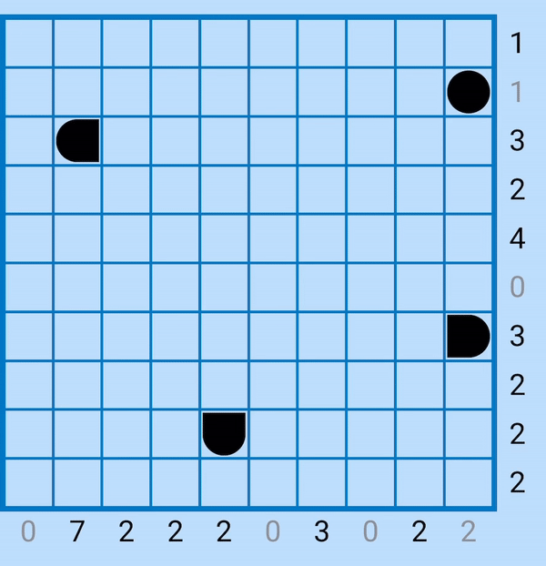
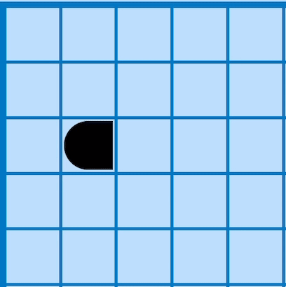

# Bimaru-Solver
by Pedro Curvo (@pedrocurvo)

This project is a solver for the Bimaru Puzzle and was developed as a project for the course of Artificial Intelligence at Instituto Superior Técnico.  
The images used bellow and some ideas for constrains were given by playing the game on the app
_Sea Battle_ by _AculApps_ available on the [App Store](https://apps.apple.com/pt/app/sea-battle-unlimited/id6444275561?l=en) and [Play Store](https://play.google.com/store/apps/details?id=ch.aculapps.seabattleunlimited&hl=en).

## 1. What is Bimaru?
A **Bimaru puzzle**, also known as **Battleship Solitaire** or **Battleships**, is a logic-based puzzle that involves filling a grid with ships while satisfying certain clues or hints provided. It is played on a rectangular grid, typically square in shape.  
The objective of a Bimaru puzzle is to place a fleet of battleships (or ships) within the grid, following specific rules. The grid is divided into cells, and each cell can either contain a ship segment or be empty. The ships in the puzzle are represented by connected segments, either horizontally or vertically, without touching each other.

The puzzle begins with some clues provided outside the grid, often represented by numbers. These clues indicate the number of ship segments in each row and column. The clues may be placed at the beginning of each row and column or at the end, and they indicate the length of the ship segments and their arrangement within the corresponding row or column.

To solve the puzzle, you must use deductive reasoning and logical thinking to determine the placement of ships based on the given clues.
The rules for placing ships are as follows:
- Ships cannot touch each other, not even diagonally.
- Ships cannot occupy cells filled by Water.
- Each row and column must have the exact number of ship segments as indicated by the clues.
- The ships should be arranged in a straight line, either horizontally or vertically.

Using the provided clues and following these rules, you gradually fill in the grid, marking ship segments and empty cells until the entire puzzle is solved. The challenge lies in deducing the correct placement of ships by considering the constraints imposed by the clues and the already filled cells.

Bimaru puzzles can come in various sizes and difficulty levels, ranging from small grids with a few ships to larger grids with numerous ships. They provide an engaging and enjoyable exercise for logical thinking and problem-solving skills.

This Project is a solver for the Bimaru Puzzle on a **10x10 grid** with the following ships: 
- **4** ships with size **one**
- **3** ships with size **two**
- **2** ships with size **three**
- **1** ship with size **four**

## 2. Input Format
You can create an Instance of this problem by providing a text file with the following format as example:
```
ROW 2 3 2 2 3 0 1 3 2 2
COLUMN 6 0 1 0 2 1 3 1 2 4
6
HINT 0 0 T
HINT 1 6 M
HINT 3 2 C
HINT 6 0 W
HINT 8 8 B
HINT 9 5 C
```
You should run the program with the following command:
```
python3 bimaru.py < filename.txt
```
In the example above, each line of the input file is explained below:

- ```ROW``` section:
Numbers represent clues for each row. Example:
```ROW 2 3 2 2 3 0 1 3 2 2```

- ```COLUMN``` section: Numbers represent clues for each column. Example:
``` COLUMN 6 0 1 0 2 1 3 1 2 4 ```

- Number of Hints provided. Example: 
``` 6 ```

- ```HINT```s: Each HINT is represented as "HINT row column symbol". Example:
``` HINT 0 0 T ```

- The possible values for rows and columns are integers ranging from ```0``` to ```9```. The top left corner of the grid corresponds to the coordinates (0,0).

- The possible values for hints are: ```W``` (water), ```C``` (circle), ```T``` (top), ```M``` (middle), ```B``` (bottom), ```L``` (left), and ```R``` (right).


## 3. Output Format

## 4. Constraints
### 4.1 Zero Rows and Zero Columns
 

### 4.2 Around Ships 
The gifs show how to fill the waters around specific pieces. The images are self explanatory, but remind that the pieces can be on the edges of the grid, so while filling the waters around them, you should not go out of the grid.
|     One Piece ```C```  |      Top Piece ```T```     |  Right Piece ```R``` |
|:-----------------:|:---------------------:|:------:|
|   |    |   |
| Middle Piece ```M```   |      Bottom Piece ```B```     |  Left Piece ```L``` |
|   |  |   | 


  
### 4.3 Terminal Pieces 
- Terminal Rows 
- Terminal Columns 
- Fill Rows and Columns With Right Number of Pieces 
- Empty Spaces 
- Waters per Column and Row

## Heuristic 
 Probabilistic Grid
 <table align="center">
    <colgroup>
        <col span="2" style="background-color: #D6EEEE">
        <col span="3" style="background-color: pink">
    </colgroup>
    <tr>
        <td align="center" style="background-color: #FF8A8A">8.0</td>
        <td align="center" style="background-color: #FF5C5C">11.5</td>
        <td align="center" style="background-color: #FF2E2E" >14.3</td>
        <td align="center" style="background-color: #FF0000">15.9</td>
        <td align="center" style="background-color: #D10000">16.7 </td>
        <td align="center" style="background-color: #D10000">16.7</td>
        <td align="center" style="background-color: #FF0000">15.9</td>
        <td align="center" style="background-color: #FF2E2E" >14.3</td>
        <td align="center" style="background-color: #FF5C5C">11.5</td>
        <td align="center" style="background-color: #FF8A8A">8.0</td>
    </tr>
    <tr>
        <td align="center" style="background-color: #FF5C5C">11.5</td>
        <td align="center" style="background-color: #FF2E2E">14.3</td>
        <td align="center" style="background-color: #FF0000">16.6</td>
        <td align="center" style="background-color: #D10000">17.8</td>
        <td align="center" style="background-color: #A30000">18.4</td>
        <td align="center" style="background-color: #A30000">18.4</td>
        <td align="center" style="background-color: #D10000">17.8</td>
        <td align="center" style="background-color: #FF0000">16.6</td>
        <td align="center" style="background-color: #FF2E2E">14.3</td>
        <td align="center" style="background-color: #FF5C5C">11.5</td>
    </tr>
    <tr>
        <td align="center" style="background-color: #FF2E2E">14.3</td>
        <td align="center" style="background-color: #FF0000">16.6</td>
        <td align="center" style="background-color: #A30000">18.4</td>
        <td align="center">19.4</td>
        <td align="center">19.9</td>
        <td align="center">19.9</td>
        <td align="center">19.4</td>
        <td align="center" style="background-color: #A30000">18.4</td>
        <td align="center" style="background-color: #FF0000">16.6</td>
        <td align="center" style="background-color: #FF2E2E">14.3</td>
    </tr>
    <tr>
        <td align="center" style="background-color: #FF0000">15.9</td>
        <td align="center" style="background-color: #D10000">17.8</td>
        <td align="center">19.4</td>
        <td align="center">20.4</td>
        <td align="center">21.0</td>
        <td align="center">21.0</td>
        <td align="center">20.4</td>
        <td align="center">19.4</td>
        <td align="center" style="background-color: #D10000">17.8</td>
        <td align="center" style="background-color: #FF0000">15.9</td>
    </tr>
    <tr>
        <td align="center" style="background-color: #FF0000">16.7</td>
        <td align="center" style="background-color: #A30000">18.4</td>
        <td align="center">19.9</td>
        <td align="center">21.0</td>
        <td align="center">21.6</td>
        <td align="center">21.6</td>
        <td align="center">21.0</td>
        <td align="center">19.9</td>
        <td align="center" style="background-color: #A30000">18.4</td>
        <td align="center" style="background-color: #FF0000">16.7</td>
    </tr>
    <tr>
        <td align="center" style="background-color: #FF0000">16.7</td>
        <td align="center" style="background-color: #A30000">18.4</td>
        <td align="center">19.9</td>
        <td align="center">21.0</td>
        <td align="center">21.6</td>
        <td align="center">21.6</td>
        <td align="center">21.0</td>
        <td align="center">19.9</td>
        <td align="center" style="background-color: #A30000">18.4</td>
        <td align="center" style="background-color: #FF0000">16.7</td>
    </tr>
    <tr>
        <td align="center" style="background-color: #FF0000">15.9</td>
        <td align="center" style="background-color: #D10000">17.8</td>
        <td align="center">19.4</td>
        <td align="center">20.4</td>
        <td align="center">21.0</td>
        <td align="center">21.0</td>
        <td align="center">20.4</td>
        <td align="center">19.4</td>
        <td align="center" style="background-color: #D10000">17.8</td>
        <td align="center" style="background-color: #FF0000">15.9</td>
    </tr>
    <tr>
        <td align="center" style="background-color: #FF2E2E">14.3</td>
        <td align="center" style="background-color: #FF0000">16.6</td>
        <td align="center" style="background-color: #A30000">18.4</td>
        <td align="center">19.4</td>
        <td align="center">19.9</td>
        <td align="center">19.9</td>
        <td align="center">19.4</td>
        <td align="center" style="background-color: #A30000">18.4</td>
        <td align="center" style="background-color: #FF0000">16.6</td>
        <td align="center" style="background-color: #FF2E2E">14.3</td>
    </tr>
    <tr>
        <td align="center" style="background-color: #FF5C5C">11.5</td>
        <td align="center" style="background-color: #FF2E2E">14.3</td>
        <td align="center" style="background-color: #FF0000">16.6</td>
        <td align="center" style="background-color: #D10000">17.8</td>
        <td align="center" style="background-color: #A30000">18.4</td>
        <td align="center" style="background-color: #A30000">18.4</td>
        <td align="center" style="background-color: #D10000">17.8</td>
        <td align="center" style="background-color: #FF0000">16.6</td>
        <td align="center" style="background-color: #FF2E2E">14.3</td>
        <td align="center" style="background-color: #FF5C5C">11.5</td>
    </tr>
    <tr>
        <td align="center" style="background-color: #FF8A8A">8.0</td>
        <td align="center" style="background-color: #FF5C5C">11.5</td>
        <td align="center" style="background-color: #FF2E2E" >14.3</td>
        <td align="center" style="background-color: #FF0000">15.9</td>
        <td align="center" style="background-color: #D10000">16.7 </td>
        <td align="center" style="background-color: #D10000">16.7</td>
        <td align="center" style="background-color: #FF0000">15.9</td>
        <td align="center" style="background-color: #FF2E2E" >14.3</td>
        <td align="center" style="background-color: #FF5C5C">11.5</td>
        <td align="center" style="background-color: #FF8A8A">8.0</td>
    </tr>
</table>
