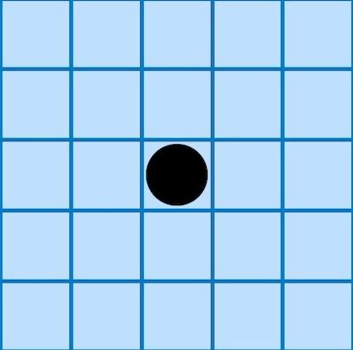
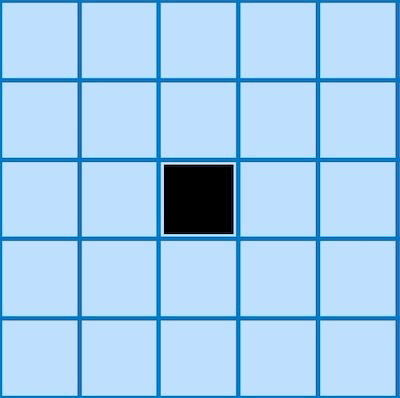

# Bimaru-Solver
by Pedro Curvo ([@pedrocurvo](https://github.com/pedrocurvo))

This project is a solver for the Bimaru Puzzle and was developed as a project for the course of Artificial Intelligence at Instituto Superior Técnico.  
The images used bellow and some ideas for constrains were given by playing the game on the app
_Sea Battle_ by _AculApps_ available on the [App Store](https://apps.apple.com/pt/app/sea-battle-unlimited/id6444275561?l=en) and [Play Store](https://play.google.com/store/apps/details?id=ch.aculapps.seabattleunlimited&hl=en).

## Table of Contents
1. [What is Bimaru?](#1-what-is-bimaru)
2. [Input Format](#2-input-format)
3. [Output Format](#3-output-format)
4. [Constraints](#4-constraints)
5. [Heuristic](#5-heuristic)

## 1. What is Bimaru?
A **Bimaru puzzle**, also known as **Battleship Solitaire** or **Battleships**, is a logic-based puzzle that involves filling a grid with ships while satisfying certain clues or hints provided. It is played on a rectangular grid, typically square in shape.  
The objective of a Bimaru puzzle is to place a fleet of battleships (or ships) within the grid, following specific rules. The grid is divided into cells, and each cell can either contain a ship segment or be empty. The ships in the puzzle are represented by connected segments, either horizontally or vertically, without touching each other.

The puzzle begins with some clues provided outside the grid, often represented by numbers. These clues indicate the number of ship segments in each row and column. The clues may be placed at the beginning of each row and column or at the end, and they indicate the length of the ship segments and their arrangement within the corresponding row or column.

To solve the puzzle, you must use deductive reasoning and logical thinking to determine the placement of ships based on the given clues.
The rules for placing ships are as follows:
- Ships cannot touch each other, not even diagonally.
- Ships cannot occupy cells filled by Water.
- Each row and column must have the exact number of ship segments as indicated by the clues.
- The ships should be arranged in a straight line, either horizontally or vertically.

Using the provided clues and following these rules, you gradually fill in the grid, marking ship segments and empty cells until the entire puzzle is solved. The challenge lies in deducing the correct placement of ships by considering the constraints imposed by the clues and the already filled cells.

Bimaru puzzles can come in various sizes and difficulty levels, ranging from small grids with a few ships to larger grids with numerous ships. They provide an engaging and enjoyable exercise for logical thinking and problem-solving skills.

This Project is a solver for the Bimaru Puzzle on a **10x10 grid** with the following ships: 
- **4** ships with size **one**
- **3** ships with size **two**
- **2** ships with size **three**
- **1** ship with size **four**

## 2. Input Format
You can create an Instance of this problem by providing a text file with the following format as example:
```
ROW 2 3 2 2 3 0 1 3 2 2
COLUMN 6 0 1 0 2 1 3 1 2 4
6
HINT 0 0 T
HINT 1 6 M
HINT 3 2 C
HINT 6 0 W
HINT 8 8 B
HINT 9 5 C
```
You should run the program with the following command:
```
python3 bimaru.py < filename.txt
```
In the example above, each line of the input file is explained below:

- ```ROW``` section:
Numbers represent clues for each row. Example:
```ROW 2 3 2 2 3 0 1 3 2 2```

- ```COLUMN``` section: Numbers represent clues for each column. Example:
``` COLUMN 6 0 1 0 2 1 3 1 2 4 ```

- Number of Hints provided. Example: 
``` 6 ```

- ```HINT```s: Each HINT is represented as "HINT row column symbol". Example:
``` HINT 0 0 T ```

- The possible values for rows and columns are integers ranging from ```0``` to ```9```. The top left corner of the grid corresponds to the coordinates (0,0).

- The possible values for hints are: ```W``` (water), ```C``` (circle), ```T``` (top), ```M``` (middle), ```B``` (bottom), ```L``` (left), and ```R``` (right).


## 3. Output Format

## 4. Constraints
### 4.1 Zero Rows and Zero Columns
 

### 4.2 Around Ships 
The gifs show how to fill the waters around specific pieces. The images are self explanatory, but remind that the pieces can be on the edges of the grid, so while filling the waters around them, you should not go out of the grid.
|     One Piece ```C```  |      Top Piece ```T```     |  Right Piece ```R``` |
|:-----------------:|:---------------------:|:------:|
|   |    |   |
| Middle Piece ```M```   |      Bottom Piece ```B```     |  Left Piece ```L``` |
|   |  |   | 


  
### 4.3 Terminal Pieces 
### 4.4 Terminal Rows 
### 4.5 Terminal Columns 
### 4.6 Fill Rows and Columns With Right Number of Pieces 
### 4.7 Empty Spaces 
### 4.8 Waters per Column and Row
### 4.9 Impossible Combinations

## 5. Heuristic 

It's important to refer that this problem is a CSP (Constraint Satisfaction Problem), so the constraints are very important to solve the problem and allow a faster execution of the algorithm. Such that the program can run fast only using the Non-Informed Search Algoritms. Beyond that aspect, is important to refer that a kind of 'intrisic' heuristic was used during the construction of the program, since it only gives actions for the 'next' boat that is missing, starting by the larger one, this allows a faster execution and a reduction in memory. This is a kind of heuristic that is not used in the h(n) function, but it's important to refer it. One may think of it has a kind of 'pre-processing' heuristic where initial the h(n) for larger boat is small and infinity for the other ones. 

A side from that, some may implement an heuristic to choose the right boat from the same lenght ships that are not yet placed. While thinking about this, I thought about the following:
- Parts of the grid that match with parts of the ships that are not yet placed
- Probabilistic Density Distribution of the ships on the Grid
  
The first one is easier to implement, but the second one is quite a challenge, since this probability distribution is not static, it changes as the grid is filled. Since the goal of this project is to solve the puzzle, I decided to implement the first one with a static version of the second one, but for more information
about the second one, you can check the links bellow to have an idea of how probability distributions can be used to solve this problem or to win the normal battleship game. 
- [Battleship Probability Calculator](https://cliambrown.com/battleship/)
- [Coding an Intelligent Battleship Agent](https://towardsdatascience.com/coding-an-intelligent-battleship-agent-bf0064a4b319)
- [The Battleship Algorithm](https://www.youtube.com/watch?v=LbALFZoRrw8&t=88s)


 **Probabilistic Grid** used for the h(n)
 <table align="center">
    <colgroup>
        <col span="2" style="background-color: #D6EEEE">
        <col span="3" style="background-color: pink">
    </colgroup>
    <tr>
        <td align="center" style="background-color: #FF8A8A">8.0</td>
        <td align="center" style="background-color: #FF5C5C">11.5</td>
        <td align="center" style="background-color: #FF2E2E" >14.3</td>
        <td align="center" style="background-color: #FF0000">15.9</td>
        <td align="center" style="background-color: #D10000">16.7 </td>
        <td align="center" style="background-color: #D10000">16.7</td>
        <td align="center" style="background-color: #FF0000">15.9</td>
        <td align="center" style="background-color: #FF2E2E" >14.3</td>
        <td align="center" style="background-color: #FF5C5C">11.5</td>
        <td align="center" style="background-color: #FF8A8A">8.0</td>
    </tr>
    <tr>
        <td align="center" style="background-color: #FF5C5C">11.5</td>
        <td align="center" style="background-color: #FF2E2E">14.3</td>
        <td align="center" style="background-color: #FF0000">16.6</td>
        <td align="center" style="background-color: #D10000">17.8</td>
        <td align="center" style="background-color: #A30000">18.4</td>
        <td align="center" style="background-color: #A30000">18.4</td>
        <td align="center" style="background-color: #D10000">17.8</td>
        <td align="center" style="background-color: #FF0000">16.6</td>
        <td align="center" style="background-color: #FF2E2E">14.3</td>
        <td align="center" style="background-color: #FF5C5C">11.5</td>
    </tr>
    <tr>
        <td align="center" style="background-color: #FF2E2E">14.3</td>
        <td align="center" style="background-color: #FF0000">16.6</td>
        <td align="center" style="background-color: #A30000">18.4</td>
        <td align="center" style="background-color: #9B111E">19.4</td>
        <td align="center" style="background-color: #960018">19.9</td>
        <td align="center" style="background-color: #960018">19.9</td>
        <td align="center" style="background-color: #9B111E">19.4</td>
        <td align="center" style="background-color: #A30000">18.4</td>
        <td align="center" style="background-color: #FF0000">16.6</td>
        <td align="center" style="background-color: #FF2E2E">14.3</td>
    </tr>
    <tr>
        <td align="center" style="background-color: #FF0000">15.9</td>
        <td align="center" style="background-color: #D10000">17.8</td>
        <td align="center" style="background-color: #9B111E">19.4</td>
        <td align="center" style="background-color: #4C0805">20.4</td>
        <td align="center" style="background-color: #4C0805">21.0</td>
        <td align="center" style="background-color: #4C0805">21.0</td>
        <td align="center" style="background-color: #4C0805">20.4</td>
        <td align="center" style="background-color: #9B111E">19.4</td>
        <td align="center" style="background-color: #D10000">17.8</td>
        <td align="center" style="background-color: #FF0000">15.9</td>
    </tr>
    <tr>
        <td align="center" style="background-color: #FF0000">16.7</td>
        <td align="center" style="background-color: #A30000">18.4</td>
        <td align="center" style="background-color: #960018">19.9</td>
        <td align="center" style="background-color: #4C0805">21.0</td>
        <td align="center" style="background-color: #420D09">21.6</td>
        <td align="center" style="background-color: #420D09">21.6</td>
        <td align="center" style="background-color: #4C0805">21.0</td>
        <td align="center" style="background-color: #960018">19.9</td>
        <td align="center" style="background-color: #A30000">18.4</td>
        <td align="center" style="background-color: #FF0000">16.7</td>
    </tr>
    <tr>
        <td align="center" style="background-color: #FF0000">16.7</td>
        <td align="center" style="background-color: #A30000">18.4</td>
        <td align="center" style="background-color: #960018">19.9</td>
        <td align="center" style="background-color: #4C0805">21.0</td>
        <td align="center" style="background-color: #420D09">21.6</td>
        <td align="center" style="background-color: #420D09">21.6</td>
        <td align="center" style="background-color: #4C0805">21.0</td>
        <td align="center" style="background-color: #960018">19.9</td>
        <td align="center" style="background-color: #A30000">18.4</td>
        <td align="center" style="background-color: #FF0000">16.7</td>
    </tr>
    <tr>
        <td align="center" style="background-color: #FF0000">15.9</td>
        <td align="center" style="background-color: #D10000">17.8</td>
        <td align="center" style="background-color: #9B111E">19.4</td>
        <td align="center" style="background-color: #4C0805">20.4</td>
        <td align="center" style="background-color: #4C0805">21.0</td>
        <td align="center" style="background-color: #4C0805">21.0</td>
        <td align="center" style="background-color: #4C0805">20.4</td>
        <td align="center" style="background-color: #9B111E">19.4</td>
        <td align="center" style="background-color: #D10000">17.8</td>
        <td align="center" style="background-color: #FF0000">15.9</td>
    </tr>
    <tr>
        <td align="center" style="background-color: #FF2E2E">14.3</td>
        <td align="center" style="background-color: #FF0000">16.6</td>
        <td align="center" style="background-color: #A30000">18.4</td>
        <td align="center" style="background-color: #960018">19.9</td>
        <td align="center" style="background-color: #960018">19.9</td>
        <td align="center" style="background-color: #960018">19.9</td>
        <td align="center" style="background-color: #960018">19.9</td>
        <td align="center" style="background-color: #A30000">18.4</td>
        <td align="center" style="background-color: #FF0000">16.6</td>
        <td align="center" style="background-color: #FF2E2E">14.3</td>
    </tr>
    <tr>
        <td align="center" style="background-color: #FF5C5C">11.5</td>
        <td align="center" style="background-color: #FF2E2E">14.3</td>
        <td align="center" style="background-color: #FF0000">16.6</td>
        <td align="center" style="background-color: #D10000">17.8</td>
        <td align="center" style="background-color: #A30000">18.4</td>
        <td align="center" style="background-color: #A30000">18.4</td>
        <td align="center" style="background-color: #D10000">17.8</td>
        <td align="center" style="background-color: #FF0000">16.6</td>
        <td align="center" style="background-color: #FF2E2E">14.3</td>
        <td align="center" style="background-color: #FF5C5C">11.5</td>
    </tr>
    <tr>
        <td align="center" style="background-color: #FF8A8A">8.0</td>
        <td align="center" style="background-color: #FF5C5C">11.5</td>
        <td align="center" style="background-color: #FF2E2E" >14.3</td>
        <td align="center" style="background-color: #FF0000">15.9</td>
        <td align="center" style="background-color: #D10000">16.7 </td>
        <td align="center" style="background-color: #D10000">16.7</td>
        <td align="center" style="background-color: #FF0000">15.9</td>
        <td align="center" style="background-color: #FF2E2E" >14.3</td>
        <td align="center" style="background-color: #FF5C5C">11.5</td>
        <td align="center" style="background-color: #FF8A8A">8.0</td>
    </tr>
</table>

## 6. Classes and Suctrure of the Code 
The code is divided into 3 main classes:
1. **BimaruState** representing states in the Bimaru problem/in the search algorithms.
2. **Board** representing the board of the Bimaru problem, in this case the 10x10 grid with the boards.
3. **Bimaru** which is a derived class from **Problem**. The **Problem** class is a part of the AIMA code,
and is used to represent a problem in the search algorithms. The **Bimaru** class is used to represent the
Bimaru problem, and is used by the search algorithms to solve the problem. The functions that are overriden are:
   - **actions(state)** - returns a list of all the possible actions that can be done in the current state.
   - **result(state, action)** - returns the state that is the result of doing the action in the current state.
   - **goal_test(state)** - returns true if the state is a goal state, and false otherwise.

The code works by creating a **Bimaru** object, and then calling the search algorithms on it. In steps the code does the following:
1. Creates a **Board** object with the txt file that is given as input using the function ***Board.parse_instance()***.
2. Creates the **Bimaru** object (hereby treated as problem) with the **Board** object as input. This board instance is used to create a **BimaruState** object, which is the initial state of the problem, attributed as problem.initial
3. The problem has also a number of expected ships **problem.expected_ships** that is used to guide the board and it will
helpeful in the goal_test function.
4. When creating the initial state we also create a list with the number of ships that are already on the board, since
the initial state can be filled already with some ships of unknown type from lenght 1 to 4.
5. Then the search alghoritm calls the action function on the initial state, and the result is a list of possible actions:
- In order to otimize the search, I deciced to only give actions with a specific type of ship, and not all the possible actions.
That is, if the 4 ship is missing we start by only sending actions with a 4 ship, and then we move to the 3 ship, and so on.
- It's important to refer that the first type and the last type of action are created inside the actions functions, since we
minimize the effort and time to build them, the 4 ships have few options so it wont take long to create them, and the 1 ship
even though it's te most common ship, it's putted last so we only needed to check the missing spaces, each, in the end, are a few. 
The boats with lenght in the middle are created in the beginning of the creation of the Bimaru problem, since they are
harder to create and take more time to be created recurseveli. So, if we create all the options for those ships in the beginning
and then only check the ones that can fit we can minimize the time to create the options.
6. Then the search algorithm calls the result function on the initial state and the action, and the result is a new state.
It's important to refer that the result funtion only joins the board, incremment the number of ships and then fill the water
in the collumns and rows that are affected by the new ship and became full.
7. It is also important to refer that the actions created in the actions are only the possible ones, without the ones that
are could have broke restrictions.
8. Since we only add possible actions and never impossible cases for the game, the goal_test function only needs to check 
if the number of ships on the board are the same as the expected number of ships.