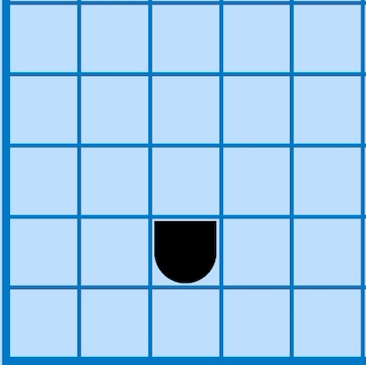
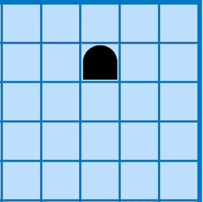
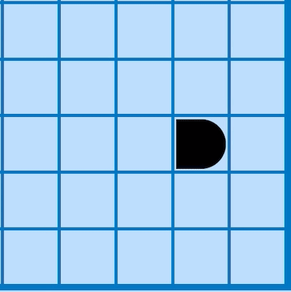

# Bimaru-Solver
by Pedro Curvo (@pedrocurvo)

This project is a solver for the Bimaru Puzzle and was developed as a project for the course of Artificial Intelligence at Instituto Superior Técnico.

## 1. What is Bimaru?

## 2. Input Format
## 3. Output Format

## 4. Constraints
### Zero Rows and Zero Columns
 

### Around Ships 
#### Around One Ship
 

#### Around Bottom Piece

#### Around Top Piece
 

#### Around Left Piece
 

#### Around Right Piece
 

#### Around Middle Piece
 
  
- Terminal Pieces 
- Terminal Rows 
- Terminal Columns 
- Fill Rows and Columns With Right Number of Pieces 
- Empty Spaces 
- Waters per Column and Row

### Heuristic 
- Probabilistic Grid